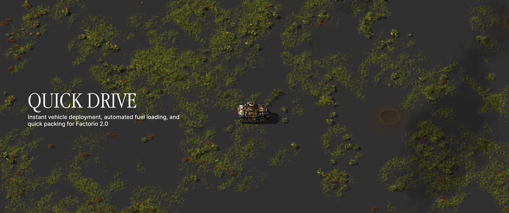
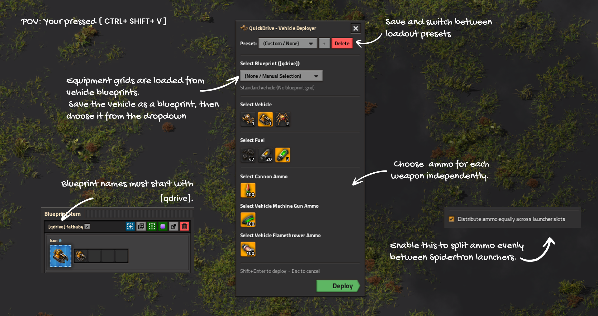

# QuickDrive

QuickDrive lets you quickly place a vehicle from your inventory, load it with your chosen fuel and ammo, and jump straight into the driver's seat using hotkeys. When you're done driving, press the keybind again to pack the vehicle and all remaining fuel/cargo back into your inventory.

---

## Controls & Keybindings

| Keybinding | Action |
| --- | --- |
| **Ctrl + Shift + V** | Open / close the QuickDrive configuration GUI. |
| **Shift + Enter** | Deploy your selected vehicle & fuel, OR pack up your current vehicle. |
| **Esc** | Close the configuration GUI. |

*Note: Keybindings can be customized at any time in Factorio's Settings -> Controls menu.*

---

## Overview & GUI Instructions

- **Open QuickDrive:** Press `Ctrl + Shift + V` to open the configuration GUI.
- **Presets:** Save your current vehicle, fuel, and ammo configuration as a reusable preset.
- **Equipment Grids & Blueprints:** Equipment grids are loaded from vehicle blueprints. Create a blueprint first, then select it in the GUI. Blueprint names must start with `[qdrive]` (e.g. `[qdrive] Combat Spidertron`).
- **Independent Ammo Selection:** Choose the ammo for each weapon independently.
- **Spidertron Ammo Distribution:** For Spidertrons, toggle equal ammo distribution across all launcher slots.

---

## Features

- **Equipment Grid & Blueprint Support:** Detects single-vehicle blueprints in your inventory or cursor. Automatically equips your vehicle's grid (modules, reactors, laser defense) from your main inventory upon deployment and safely returns grid equipment when packing up.
- **Color & Preset Customization:** Saves custom vehicle paint schemes and full grid layout configurations as reusable presets.
- **Automatic Fueling & Ammo:** Automatically loads your selected fuel and compatible ammo directly from inventory upon deployment.
- **Persistent Direction:** Inherits your character's exact orientation when entering and exiting vehicles.
- **Auto Launch / Initial Speed Boost:** Gives the vehicle an immediate forward speed burst on deployment.
- **Auto Headlights:** Automatically switches headlights on when deploying at night or in pitch darkness.
- **Support for All Vehicles:** Compatible with standard Factorio vehicles (Cars, Tanks, Spidertrons) as well as modded/electric vehicles.
- **Cargo-Safe Undeploy:** Safely recovers all contents (fuel, ammo, trunk cargo) before placing items back into your inventory.
- **Smart Tracking:** Only packs up vehicles that were deployed via QuickDrive, leaving player-built or automated map vehicles untouched.

---

## Installation

1. Download the latest `quick-drive_<version>.zip` package from the [releases](https://github.com/notenderdreams/QuickDrive/releases) page.
2. Place the `.zip` archive or extracted `quick-drive_<version>` folder into your Factorio mods directory:
   - **macOS:** `~/Library/Application Support/factorio/mods/`
   - **Windows:** `%APPDATA%\Factorio\mods\`
   - **Linux:** `~/.factorio/mods/`
3. Start Factorio and verify that QuickDrive is enabled in the Mods menu.
